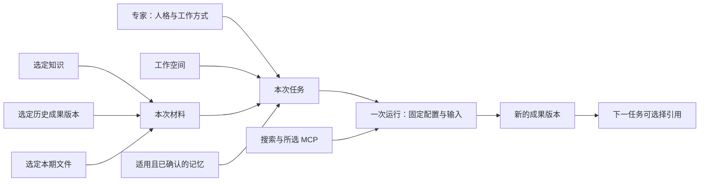

# 专家与任务材料设计 v0.2

- 日期：2026-09-13；修订：2026-09-14。
- 状态：**Accepted / 已定稿，待开发**。2026-09-14 用户完成 v0.2 评审并要求落实设计、形成开发计划；本稿产品关系、交互与 E1–E5 范围正式生效。未指定的实施技术在对应开发卡中定案，不再重复请求同一设计批准。
- 执行入口：[开发计划与任务板](../development/tasks-experts.md)；配套 [ADR-0014](../adr/0014-expert-context-and-material-binding.md) 已接受，代码尚未实现。本文“建议默认值”按已通过评审的默认方案执行；MCP、记忆投影和解析技术仍按计划内的实现 ADR 任务落实。
- 前置调研：[专家工作模型](../reviews/2026-09-13-expert-work-model.md)，包含 ClawBible Desktop 源码核对。
- 配套 v0.2 草图默认打开专家列表，可召唤进入对话、发送示例需求、通过“＋”补材料、展开本次材料、编辑示例配置和从成果开始新任务。全部为合成本地交互，无真实模型、文件或配置保存。

## 本轮修正

- 删除独立任务准备表单和“返回任务准备”导航。专家列表/详情以“召唤”为主要操作，“编辑配置”独立进入，退出回专家页。
- 召唤进入已有任务对话形态，沿用当前工作空间，输入框立即可用；不要求先填写标题、期间、工具、记忆或材料用途。
- 常用能力和适用参考由系统带入，只显示简短摘要；能力、材料及记忆的完整清单按需展开。
- 未提供本期数据不阻止交流。专家先理解目标，发现缺项时在对话中指出并提供补材料入口；只有依赖缺失材料的分析/生成动作需要等待。
- 版本、范围、授权及来源追踪仍由宿主落实，用户不需要先做一次“工作依据预览”才能发送消息。

## 1. 设计出发点

用户已明确：专家拥有人格、工具、MCP、Skill 和记忆，用于重复工作；通用助手保留自由组合能力的临时工作入口。专家结合选定知识、历史成果、当前工作空间材料及网上资料完成新工作，不能默认使用全部知识和成果。

本稿以“本月经营报告 PPT”为主线：选择经营分析专家 → 引用公司财务规则 → 参考上个月最终报告 → 使用本月数据 → 补充外部资料 → 讨论并生成本月报告。下一月继续复用。

核心设计：**专家保存工作方式；工作空间组织长期项目；任务选择本次依据；每次运行固定实际配置与材料版本；成果进入后续工作的可选输入。**

## 2. 用户看到的对象

| 对象 | 承担什么 | 不承担什么 |
| --- | --- | --- |
| 工作空间 Workspace | 长期项目、部门或客户，关联目录、任务与材料 | 不自动把目录全部内容交给每位专家 |
| 专家 Expert | 角色、工作方法、工具/MCP、Skill、常用参考、输出偏好和经验 | 不拥有每次任务的全部业务事实，不独占公共资源 |
| 任务 Task | 本次目标、专家选择、材料选择和交付要求 | 不用同一个任务无限累加所有月份 |
| 知识 Knowledge | 财务制度、指标定义等参考依据 | 不自动等于记忆 |
| 成果 Artifact | 报告、PPT 等交付物及版本 | 不自动等于已验证知识或本期事实 |
| 记忆 Memory | 经确认的偏好、方法和上下文经验 | 不把历史聊天全文作为长期记忆 |

首版界面统一称“工作空间”。“项目空间”是它承接项目时的用途，不另建 Project 实体、第二套目录或平行导航。用户可以把工作空间命名为“财务经营分析”或某个具体项目。

通用助手的普通问答可以没有材料、没有 Skill；不强制所有任务填写经营分析的输入槽位。专家任务按自身输入要求校验，月报只是本稿的示例。



专家、知识和成果都是可复用对象，连接通过引用建立。引用成果不复制成果、不改变归属，也不把整个来源任务的聊天记录带入当前任务。

## 3. 专家配置

### 3.1 专家管理页

一级入口“专家”复用现有页面骨架。卡片以名称、职责简介和主要 Skill 为主，主要按钮为“召唤”；配置、复制、启停与归档放次级入口。点击“召唤”直接进入该专家的新任务对话，沿用当前工作空间并聚焦 Composer。此时不调用模型或脚本；用户发送第一条非空消息后才开始 Run。

专家详情仍可“召唤”。“编辑配置”进入独立编辑区域，保存或取消回到专家页，不经过任务。已经在对话中的“查看专家”打开可关闭的简要信息面板，关闭回原对话且保留草稿；它不承担全局专家页导航。独立专家页没有“返回任务准备”按钮。

只有用户进入“编辑配置”时才展示以下四组；召唤后不重复要求配置：

| 分组 | 字段与操作 | 建议默认值 |
| --- | --- | --- |
| 身份与工作方式 | 名称、头像/图标、简介、人格与职责、工作原则、输入要求、交付与检查要求 | 中文表单，系统提示词在高级区展开；两者映射同一配置，不保留互相冲突的双份指令 |
| 能力 | 多项 Skill、内置工具、MCP 连接下的具体工具、模型偏好 | 最多沿用现有 6 项 Skill；模型继承应用默认，可引用已配置模型 |
| 常用参考 | 知识与模板引用、适用工作空间、用途 | 默认为候选，匹配工作空间后可预选并显示来源；不授予全部知识库权限 |
| 记忆 | 内容、来源、适用范围、更新时间、有效期、编辑/删除 | 仅 confirmed 参与后续执行；模型建议待确认 |

保存专家配置草稿允许缺项。模型、信任或必要依赖缺失时显示具体原因，发送时执行既有授权校验；它们与缺少本期业务材料分开。未提供本期数据不禁用“召唤”，也不阻止理解需求的对话。

### 3.2 稳定要求与每次输入

专家的工作指令描述所需输入，例如报告期间、当期经营数据、上期报告、指标口径和公司模板。通过用户消息与选定材料识别这些信息，有歧义或缺项时在对话中询问；不把这些要求生成启动前的必填表单，也不做可编程输入槽位引擎。

- 通用财务分析专家：长期绑定分析方法与通用参考；公司规则和模板在工作空间中选择。
- 公司专用专家：可保存仅在该公司工作空间适用的规则与模板引用。
- 上期报告和当期数据：每期变化，保留在任务，不默认固化进专家。

复制专家默认复制配置与有效引用，不复制记忆内容、任务历史、公司文件或凭据。原引用在目标工作空间不适用时显示缺项。内置专家通过副本编辑，用户修改不被升级覆盖。

## 4. 材料选择与使用规则

### 4.1 两级选择

**工作空间材料范围**用于缩小选择器的候选清单：关联哪些知识、已有成果和本地目录。**任务材料清单**决定本次运行可使用哪些内容。放进工作空间不等于已加入任务。

添加材料默认查看当前工作空间；用户可显式切到“我的全部知识/成果”，选择后标明来源工作空间。专家不能自行跨空间搜索私有资料；这是个人资料的使用范围管理，不宣称企业多租户隔离。

专家常用参考只有在全局适用或当前工作空间匹配时才进入草稿；工作空间本身不预选全部材料。自动带入项仍出现在同一清单中，可移除。移除必需输入后指出未满足的要求，不悄悄补回。

### 4.2 来源类型与用途分开

| 来源 | 选择粒度（首版） | 版本处理 | 常见用途 |
| --- | --- | --- | --- |
| 知识 | 具体文档，多选；目录/集合只用于筛选 | 运行固定已提取内容的修订与哈希 | 规则口径、背景参考 |
| 历史成果 | 具体 ArtifactVersion，可预览再选 | 精确引用选定版本；不追随最新版本 | 历史对比、结构参考、模板 |
| 工作空间文件 | 具体文件，多选 | 运行前核对内容，创建受管输入快照 | 本期数据、部门说明、模板 |
| 外部网页 | 运行搜索发现，或用户提供链接 | 抓取时间、URL、正文/摘录哈希与定位 | 外部背景、事实依据 |

材料用途由专家预设、添加入口与当前要求提供默认判断，有歧义时由专家询问。用户可在材料详情调整，不必为每个附件逐项填写。主要用途为：**规则口径 / 本期输入 / 历史对比 / 结构参考 / 模板 / 背景参考**，可写简短备注。同一个文档不重复绑定；兼有用途写入备注。

“上期 PPT”选为结构参考时，专家可借用汇报组织方式，但不能当成本期数据。“规则口径”不等于系统指令：材料中的文本不具有扩大工具授权或修改专家配置的效力。

### 4.3 选择器

入口统一由 Composer `+` 菜单和右栏“资料 → 本次材料”提供，底层维护同一份草稿。`+` 保留既有“技能 / 专家 / 添加文件”分组，并增加“引用知识 / 引用成果”；“添加文件”可从工作空间选择文件。工具与 MCP 的具体配置收进能力详情，专家任务默认沿用其能力配置，不在输入框旁常驻工具开关。通用助手仍可按需选择可用能力。专家单选，其余按对应粒度多选。

选择器显示：名称、来源位置、日期/统计期间、版本、可读取状态；选中后可调整用途。历史成果必须能展开版本并预览。目录不能直接作为无限范围授权，选择目录时先枚举文件供勾选；新增文件不会自动进入已建任务。

按“添加”提交选择器草稿，按“取消”不改变任务。选择失败保留已选内容，错误在当前区域说明。

### 4.4 已选与已读分开

右栏“资料”包含：

- 本次材料：已选来源、用途、版本和就绪状态。
- 已查阅来源：本 Run 实际读取的片段和外部来源，可定位到页/段落/Sheet/Slide。
- 适用记忆：本次允许使用及实际读取的已确认记忆，可展开来源。

清单只注入标题、用途、期间、可读取定位和必要摘要。正文按需检索或读取，不能把所有附件全文一次塞进模型输入。超过上下文预算显示尚未读取的材料，不静默假装全部读过。

“已选择”“已读取”“输出引用”是不同事实。读过不代表验证过，选择过不代表成果采用了；没有正文定位的搜索摘要明确标为摘要。

## 5. 新建任务与持续工作

### 5.1 召唤后直接对话

```text
工作 / 财务经营分析                         [本次材料 · 2]

经营分析专家
你想完成什么工作？

已带入常用参考：公司财务规则、公司汇报模板

[＋] 参考上月报告，帮我做本月经营汇报……
经营分析专家 · 3 项技能                           [发送]
```

默认界面只有对话、输入框、当前专家与紧凑材料摘要。任务标题由首条消息生成并可后续修改；期间从用户要求与材料中识别，不展示独立必填字段。材料、能力、记忆均按需展开，右栏允许完全收起，不常驻任务设置表单。窄窗口重排或使用可关闭覆盖面板；普通正文至少 14px，反馈复用既有路由。

导航规则：左栏“专家”始终进入专家列表；“工作”返回当前对话。再次召唤创建独立对话草稿，不把原任务改成另一个专家；已有草稿按任务保存，不因查看或配置专家而丢失。点击召唤本身不会发送一条虚构任务。

### 5.2 在对话中逐步完成工作

1. **表达目标**：召唤后直接输入“参考上月报告，做本月经营汇报”，也可以先用“＋”添加材料再发送。
2. **补齐信息**：专家检查已带入的规则与模板，回复“请提供本月数据，并选择上月报告”。回复提供“添加文件 / 引用成果”等对应入口，不跳转任务准备页。缺少期间时只问期间，已知信息不重复询问。
3. **读取与核对**：用户补入材料，清单摘要即时更新；用户继续发送后，系统固定本次引用和能力并执行。材料已齐时直接进入分析，不强制再次预览或逐项确认。
4. **分析与研究**：处理当期数据，按需要调用已配置能力搜索外部背景，展示实际来源。数值计算交给确定性工具；涉及口径冲突时在对话中讨论。
5. **报告与 PPT**：沿用既定业务讨论节点讨论大纲、报告与 PPT，再生成和验证文件。业务内容审阅不等于每次运行前的技术配置确认。
6. **交付**：成果保持版本与来源追踪；查看、导出和后续修改走已有成果体验。

示例：用户发送需求 → 专家提示缺少本月数据和上月报告 → 用户加入两份材料并发送“做 9 月的，重点关注现金流” → 专家核对并分析。全程在同一对话中完成。

缺少业务输入时，理解与澄清 Run 可正常结束；依赖它的计算/生成动作不能伪造执行。模型未配置、Skill 信任失效等运行前置仍按原协议拒绝启动。对已加入但失效的附件，在当前对话内提供移除或重新选择操作。

首版无需通用 Workflow 引擎。建议用结构化讨论节点记录当前阶段、审阅材料与反馈入口；本稿不新增 `run.waiting`，暂停讨论是已结束 Run 后的 Task 状态，不能只靠模型一句“等待确认”维持。

### 5.3 再做一期

在成果详情或已完成任务中提供“基于此成果开始新任务”：

- 新建 Task/Session，沿用工作空间；默认原专家，若已停用则提示选择。
- 引用用户点击的精确成果版本为“历史对比”；若只需要版式，可改用途。
- 复制工作目标的结构与当前适用规则/模板候选；**清空统计期间和所有本期输入**，要求补入新材料。
- 不复制整段聊天、过去的外部网页结论或上期数据作为本期输入。
- 如果需要同比，应再选择同期数据；仅有上月报告不能声称具备同比依据。

直接进入沿用该专家的对话，显示已引用的上期成果；用户发消息说明本期目标，缺少期间与数据时由专家在对话中询问。无单独的期间填写页或准备确认页。初版不自动按月份挑“最新报告”，避免日期与最终版本误判。

### 5.4 通用助手与专家切换

新任务默认通用助手，可直接选能力与材料。选择专家后带入其能力预设和适用常用参考；已有手动能力选择作为本次调整保留，与预设去重合并，手动材料也保留。不为普通带入增加确认；只有真实冲突（例如超过 Skill 上限）才内联说明并要求调整。不同专家的专属参考不残留为隐式授权。

任务首次运行后锁定执行者身份。建议切换为其他专家时“以这些材料开始新任务”，默认只复制用户选择的材料与用户确认的目标摘要，不带旧专家私有记忆和完整回复历史。普通能力或材料调整仍可在同一专家任务内从下次 Run 生效。

专家配置更新不会热改正在运行的任务。已有任务提示“专家有新版本”，用户查看差异后应用；新任务默认最新配置。Skill 撤销与停用始终实时生效，不因快照豁免。

## 6. 版本、移除、记忆与边界

### 6.1 材料变化

- 来源在草稿选择后变化：开始前显示“内容已更新”，重新确认版本/快照；不静默沿用旧摘要配新文件。
- 运行开始后：固定受管输入快照，不读取正在被外部编辑的新内容。快照按哈希去重，文件落盘与 SQLite 登记需有原子恢复语义。
- 成果出现新版本：本任务保留所选旧版本，可显式更新；更新后下一 Run 采用新版本。
- 文件不存在、格式不可读或快照损坏：在当前对话提供重新选择/移除入口；不能携带无效绑定执行，但移除后仍可进行澄清对话。缺少业务资料只阻止依赖该资料的动作，不阻止交流；不静默跳过无效附件。
- 取消后保留已完成成果和历史；未完成文件不标记为正式成果。

### 6.2 移除材料不能只修改下一次工具白名单

现有 `RunService.buildPreviousMessages` 会重建此前回复，被移除材料的内容可能已经出现在历史里。因此建议：任务在**减少材料/记忆范围或改变适用范围**时创建新的上下文段，下一 Run 不自动带入旧段助手回复，只带用户确认的目标、当前选择和明确保留的成果。旧历史仍可在 UI 回看，清单旁说明“后续工作使用调整后的材料重新开始”。

新增材料时可继续原段，但旧回复只是历史背景，不能替代当前材料版本。人格/专家切换通过新任务处理。该上下文段是运行取历史的边界，不新造平行的 Conversation 实体。

已发给模型的内容无法通过移除按钮撤回，历史记录也不自动删除。本设计承诺后续运行不重新注入被排除的上下文，不承诺原生脚本进程与外部模型的全面隔离。

### 6.3 记忆规则

用户级偏好、工作空间经验、专家通用经验以及“专家 + 工作空间”的专属经验分别匹配。最后一种同时满足两个 ID 才适用，不能把专家范围与工作空间范围简单取并集。公司财务制度仍以选定 Knowledge 为依据；记忆中的口径说明如与本期规则冲突，先指出冲突，不自行覆盖。

默认只读取 confirmed 且有效的记录。支持查看、编辑、删除、本任务不用；新增建议展示原文与来源供确认。用户明确说“记住这个”时记录范围，含公司事实默认当前工作空间。删除后后续检索与 Markdown 投影同步失效，历史 Run 仍保留当时使用记录；需要彻底清理历史另走数据删除流程。

### 6.4 MCP 与工具

连接在独立设置中配置和检测；专家/任务选择具体工具，例如“查询经营指标”，不是整个连接的所有工具。凭据留在宿主，不放进专家导出或提示词。网络搜索是可选择能力，搜索发现的新网页可在该 Run 内读取并登记来源，无需逐条预选；访问其他私有知识或成果则必须先加入任务材料。

首个 MCP 场景建议从只读查询开始。协议传输、认证、工具名映射、连接共享、进程生命周期、取消和超时在后续 MCP 任务卡与专门 ADR 中确定。需要外部写入的工具单独设计授权，不能用一个“联网”开关概括。

工具注册、调用、知识检索、文件读取和成果读取均检查本 Run 的实际范围。现有脚本按本机用户权限运行，路径策略不等于 OS 沙箱；用输入快照与受管路径约束正常执行，不宣称可以阻止任意受信任脚本读取本机其他文件。

## 7. 技术设计摘要

完整关系决策见已接受的 ADR-0014。本节为开发评审提供落点，不是已发布 Schema。

| 概念 | 持久化建议 | 执行意义 |
| --- | --- | --- |
| Expert / ExpertRevision | SQLite 当前身份与不可变配置修订 | 运行可回溯人格、能力预设和常用参考 |
| TaskContextRevision | Task 的持久化准备配置：工作空间、执行者修订、目标参数、所选材料、能力草稿和上下文段 | 重启恢复草稿；启动时显式提交修订 ID 与期望版本 |
| MaterialReference | 判别联合：knowledge revision / artifact version / workspace input snapshot | 来源身份和内容修订不混为路径字符串 |
| RunContextSnapshot | 运行准备成功后固定材料、专家、记忆范围、工具与模型配置引用 | 运行不重新查询可变“当前配置”扩大权限 |
| RunMaterialRead / RunMemoryRead | 实际读取的片段、版本、定位、时间 | 分离可用清单和已查阅记录 |
| ArtifactInputRelation | 新成果版本关联输入成果版本和其他来源记录 | 上期报告与本期报告之间可追溯 |
| DiscussionCheckpoint | Task 的阶段、审阅材料版本、待用户决定项及反馈 | 重启后仍知道讨论位置，不要求 Run 持续等待 |

与 ADR-0012 的关系：Skill 的事实绑定继续属于 Run。TaskContextRevision 只保存**可编辑且界面可见的下一 Run 选择**，不是执行授权，也不让 RunService 隐式回落旧绑定。这个持久化草稿关系需要 ADR-0014 明确扩展原先“仅从最近 Run 推导”的界面策略。

依赖方向保持 Renderer → Preload → Application → Agent Core / Infrastructure / Tool Runtime。Application 解析配置、准备快照、过滤检索、记录读取与来源；Agent Core 只获得已解析的指令、上下文和工具。

IPC 分组建议：专家管理、任务准备读取/更新/预检、材料候选查询与预览、记忆管理；运行启动继续现有入口但增加明确的上下文修订引用。全部在共享协议定义、Zod 边界校验；调用用 reportAction/trackAction 收口。

旧任务历史与旧 Run 按原事实保留，不伪造历史专家、材料快照或读取足迹。旧任务继续工作时建立可见的新准备修订；历史上未记录的资料不能从路径或回复推断成已授权材料。现有 `read_text_file` 的 Workspace 路径校验需叠加本次材料检查，不能只在新增工具中实施范围。

用户发送时由系统完成快照准备和预检，再事务创建 Run、ContextSnapshot 与既有 Skill 绑定；没有单独准备页或第二次“开始”。执行前置失败不留半个可执行 Run；准备是可取消的可见操作。启动后的异常、取消与应用重启仍保持现有终态收口。素材快照重启清理按引用计数与准备记录恢复，不在启动代码临时补列。

## 8. 首版交付切片

E1–E5 已拆成 [27 张开发任务卡](../development/tasks-experts.md)，新任务状态只在该计划维护；旧 B/C 项目按映射归并，A/B0 历史完成状态保留。

| 切片 | 可交付结果 | 完成证据 |
| --- | --- | --- |
| E1 专家与执行 | 管理专家、选择执行者、多 Skill/工具范围、版本快照；通用助手保留 | 两专家实际模型输入与工具清单不同，停用/撤销有效 |
| E2 材料与来源 | 知识/历史成果/当前文件选择、用途、版本、按范围读取、上下文收缩、来源关联 | 未选文档、越权路径和其他成果不能从宿主工具读出；缩范围后历史不泄漏 |
| E3 最小记忆 | 作用域、确认、编辑删除、读取追踪与投影 | 同专家跨工作空间不串公司经验；新任务复用已确认记忆 |
| E4 MCP 与研究 | 可用连接、具体工具选择、只读真实调用、网页正文来源 | 未选工具不可调用，断线/取消明确；网页正文与摘要区分 |
| E5 两期真实工作 | PPTX/XLSX 等必要输入读取、讨论节点、报告与可编辑 PPT 生成、下期复用 | 两期合成经营数据 + 真实公司模板路径，第二期重用规则/结构并重新计算 |

E2 先用已有 Markdown/Text/PDF/DOCX 与 Markdown 成果走通精确选择，但**这只能算材料基础切片**。月度报告验收必须补 PPTX 内容提取（文本、表格、备注与页号）及 XLSX/CSV 的表头、Sheet/Range、公式/缓存值状态，不能把 PPT 缩略图当成可分析内容，也不能用 UI 截图代替可编辑 PPTX 产物。旧报告里的图片图表不能可靠取数时，明确要求源表，不猜数。

不引入自动调度、多 Agent、通用 DAG、企业权限、公开市场或完整 Office 编辑器。现有 A 的真实样本/安装验收与 B0 的人工验收仍需完成，不因设计稿而宣称通过。

## 9. 失败与验收矩阵

| 用例 | 预期 |
| --- | --- |
| 专家页点击召唤 | 直接进入该专家对话；无准备页、无自动发送，输入框可立即使用 |
| 未提供本月数据便发送需求 | 专家在对话说明缺项并提供添加入口；不弹出必填表单、不编造分析 |
| 查看/编辑专家后退出 | 全局配置回专家页；对话内简要查看关闭回原对话，消息与草稿不丢失 |
| 专家 A 与 B 使用不同知识 | 未选资料不进入候选检索结果、正文工具、引用或系统指令 |
| 同专家在两公司工作空间运行 | 只加载当前适用参考和记忆；跨空间引用必须显式选择 |
| 上期 PPT 已有 v4，任务选的是 v3 | 保留 v3 并提示有新版本，不自动替换 |
| 本期数据在运行准备时被修改 | 检测变化，重新确认或重新准备；绑定内容与哈希一致 |
| 移除含财务数据的材料 | 下一 Run 新上下文段不注入旧助手回复；旧 UI 历史保留 |
| 专家必需 Skill 被撤销 | 复用既有级联取消，不兜底加载原工具 |
| 所选 MCP 离线 | 说明不可用工具；必需输入依赖它则不能执行，运行中断线记录 tool.failed |
| 记忆是 candidate、过期或已删除 | 不进入下一 Run；删除 confirmed 后按范围收缩处理旧上下文 |
| 模型建议复制上月结论 | 检查期间与数据依据；真实验收对比固定期望值，不靠模型自评分 |
| 模型读取全部材料后只用部分 | 已选、已读、成果引用分别显示，不伪造“全部采用” |
| 应用重启/任务准备取消 | 草稿恢复，临时快照可清理；已启动 Run 有唯一终态 |
| 下个月点击再做一期 | 新 Task/Session，无旧聊天；保留所选历史成果版本，清空本期输入和期间 |

自动测试用可注入模型、检索和 MCP 替身及合成文件，禁止触网；协议、迁移、范围过滤、历史分段和取消重点覆盖。真实模型、PPT 可编辑性、公司模板和安装态另记人工验收。实现提交前执行 npm run verify；本稿仅做链接与差异检查。

## 10. 已确认的设计基线

2026-09-14 用户已通过 v0.2 评审，以下关系与交互作为实现验收基线。

召唤直接进入对话，缺项在对话补充，配置和材料详情按需展开。新依赖、具体 Schema 与存储实现选择按开发计划落档；设计通过不等于实现或验收完成。

1. **专家与任务的分工**：专家固定方法和常用参考；每次任务显式选择本期材料与历史成果。
2. **两级材料范围**：工作空间组织候选，任务决定实际可用内容；常用参考可见、可移除。
3. **每期独立任务**：从上期成果新建任务，清空本期数据，避免无限长月报对话。
4. **专家切换与记忆边界**：首次运行后更换专家建新任务；减少材料/记忆范围时重新开始上下文。
5. **完整验收范围**：包含真正的 PPT/XLSX 输入读取、最小记忆与 MCP 调用；只有专家 CRUD 不算完整交付。
