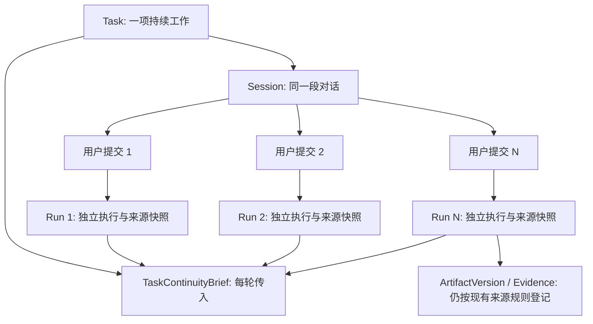

# Task 跨 Run 连续协作设计 v1.0

> 日期：2026-10-05。
> 状态：**产品与架构方案已于 2026-10-05 获用户批准；TC01 已完成，TC02–TC05 尚未开始。** 用户可见模型保持“一个任务中的连续多轮对话”；Task / Session / Run 的内部职责不合并。当前处于开发/测试阶段，既有数据无生产意义，可为验证重置；不做旧对话回填或历史 Task 兼容。
> 决策见 [ADR-0038](../adr/0038-task-continuity-across-runs.md)（Accepted）。技术落地见 [Task Continuity 实施契约](../development/task-continuity-contracts.md)、[TC 唯一任务板](../development/tasks-task-continuity.md) 与 [GPT-6 Luna 逐卡提示词](../development/task-continuity-coding-prompts.md)。代码需遵守当前 [UI/UX 体系](../10-ui-ux-system.md) 和[工程规范](../12-engineering-standards.md)。
> 依据：[领域模型](../02-domain-model.md)、[系统架构](../03-system-architecture.md)、[ADR-0008](../adr/0008-personal-workbench-and-capability-first.md)、[ADR-0014](../adr/0014-expert-context-and-material-binding.md)、[UI/UX 体系](../10-ui-ux-system.md)、[记忆实施契约](../development/memory-contracts.md)。

## 1. 决策摘要

算台的用户心智是：**一个 Task 是一项持续工作的对话，用户在同一任务里多轮追问、修订并接收成果。** 用户提交每一轮后，系统启动一个独立 Run 执行本轮请求；Run 是执行记录，不是新任务，也不是需要用户理解的对话概念。

每个新 Run 都要获得一份有界的 Task Continuity Brief（任务连续简报），其中包括当前任务目标、仍生效的用户要求、最近进度和未完成事项。简报不依赖完整聊天历史是否能重放。安全历史重放继续补充细节，但不再承担唯一的短期记忆责任。

Task Continuity Brief 是 Task 局部的工作上下文：它不是长期 Memory、WorkspaceBrief、Run 权限，也不能授权读取任何旧材料。

## 2. 问题与目标

同一 Task 的 Run 独立持久化是合理的执行边界，但当前每轮上下文主要依赖有限的安全历史重放。历史只选已完成且依赖可证明安全的问答对，并受 8 对、12,000 code points 上限约束；失败 Run 不作为完整问答对重放，超预算时整对跳过。[现行契约](../development/memory-contracts.md#63-安全历史重放)

Task 的 `goal` 已持久化，但当前 Run 上下文组装没有把它作为稳定的任务目标单独传入。因此失败后用户说“继续”，或前一轮回复过长被跳过时，后续 Run 可能缺少最初目标和近期进度。本轮只读排查复现了这两类断点。

本设计要做到：

1. 用户留在同一任务对话中继续工作，无须每轮重述任务背景。
2. 模型请求即使不带完整历史，也能看到任务目标、用户后续要求和最近工作状态。
3. 失败、取消、超长回答和应用重启不静默清空任务意图。
4. 任务简报不扩大材料读取范围、不把历史回答伪装成 Evidence，也不跨 Task 泄漏。
5. 执行细节可回看但不要求用户学习 Run、重放预算或记忆算法。

## 3. 用户可见行为

### 3.1 一个 Task，一段持续对话

- 用户在同一个 Task 中提交新消息时，沿用同一 Session 和已固定的 Expert 身份；该提交创建新的 Run。
- 多轮交互仍呈现为同一 Task 的消息流。每轮的进度、工具调用、错误和成果归属于该轮，并按现有过程面板渐进披露。
- Run 次数是过程审计信息。它不表示用户创建了多个 Task，也不要求用户手动管理多份对话。
- 新建 Task 才开始一项隔离的新工作；更换 Expert 继续沿用现有规则，通过新 Task / Session 明确完成。

### 3.2 失败与继续

- 首轮模型连接失败后，原始目标仍保留在 Task Brief。用户说“继续”时，助手能说明上次失败原因，并知道要继续完成什么。
- 失败不代表前一轮的工具副作用、局部文件或成果已成功；助手必须依据持久化的 Run 状态和已登记成果判断当前进度。
- 取消或应用中断同样保留 Task Brief。系统区分失败、取消、未登记成果和已登记成果，不将它们合并成“已完成”。

### 3.3 长对话与上下文面板

- 主工作区以 Task 消息流和 Artifact 为中心。Run 过程、工具参数和原始事件继续按现有 UI 规则收起或渐进披露。
- 右侧“过程”面板可以显示“本任务目标与进度”及每轮执行记录；它是可检查、可修正的上下文摘要，不是新的准备表单或发送前门槛。
- 任务简报与 WorkspaceBrief 分开：前者只解释当前 Task 的目标和进度，后者仍是 Workspace 的只读派生视图。
- 具体 UI 复用现有 Task 工作区与可收起的 ContextPanel，遵循 UI/UX 体系 §5、§6.2、§11.3、§11.5.1 和 §12；不新增一级导航或自造反馈出口。

## 4. Task Continuity Brief

### 4.1 内容与来源

Main 在每次模型请求前组装一个有界 Task Brief。字段在实现契约中定型；本稿先固定内容语义：

| 内容 | 权威来源 | 对模型的含义 |
| --- | --- | --- |
| 当前目标 | Task 创建时保存的 `tasks.goal`；若用户在 Task 简报中明确修订，则使用带来源的最新用户修订 | 持续任务意图，不是材料或权限 |
| 活跃用户要求 | 用户在同一 Task 后续提交的明确要求；原始 prompt 始终保留在对应 Run，简报中的压缩内容带来源 Run/prompt 指纹 | 用户要求的当前约束；冲突时较新的明确用户要求优先 |
| 最近进度 | 同一 Run 普通执行中产生的结构化 ContinuityUpdate；来源为该 Run | 助手整理的工作状态，不是用户批准事实，也不是隐式承诺 |
| 成果状态 | 已登记的 ArtifactVersion 与其来源 Run | 只说明登记状态、精确版本及来源，不声称内容已被业务验收 |
| 最近失败/取消 | Run Journal 的真实终态及错误类别 | 说明上次停在哪里；不推断副作用是否成功 |
| 当前消息 | 本轮用户 prompt | 本轮直接要求，优先级最高 |

Brief 区分用户指令与助手进度摘要。助手不得静默改写用户目标；模型对目标或要求的归纳必须保留源 Run/prompt 关系，用户可在过程面板修正。用户修订目标时产生可回看的新 Brief revision，不抹掉最初目标。

结构摘要（精确类型与来源校验见已批准的[实施契约 §2](../development/task-continuity-contracts.md#2-数据契约提案)）：

```text
TaskContinuityBrief
  schemaVersion: 1
  objective: { text, source: task-goal | user-edit, sourceRunId? }
  activeRequirements: [{ id, text, authoredBy, sources: [{ runId, promptHash }] }]
  progress?: {
    status: in-progress | blocked | awaiting-user | complete
    authoredBy
    completed[]
    nextAction?
    blockers[]
    artifactVersionIds[]
    sourceRunId
    sourcePromptHash
  }
```

### 4.2 持久化与更新

- 增加 Task 作用域的版本化连续简报记录，放在 Application / SQLite。它与 `TaskContextRevision` 分表分职责：后者保存 Expert、模型、Skill、工具和材料选择；Brief 保存任务意图与进度。
- 新 Task 的首个 Brief 由已持久化的 `tasks.goal` 初始化。后续 Run 的用户 prompt 即使关联 Run 失败或取消，也保留为该 Task 的用户输入来源。
- 每次 Run 可附带一个经过 Schema 校验的 `TaskContinuityUpdate`，与本次主要 Agent 执行同程产生，不额外发起第二次模型请求。它仅更新简短进度、待办、阻塞和精确 ArtifactVersion 引用；不得包含隐藏推理、泛化经验、跨 Task 偏好或“模型已读/已批准”的声明。
- Main 核对 `sourceRunId`、Run 所属 Task、ArtifactVersion 归属与哈希后，追加 Brief revision。此写入失败不得把已经完成的主 Run 改为失败；错误作为可见的简报未更新状态或安全日志处理，运行终态和 Artifact 真相不受影响。
- Run 在模型输出 ContinuityUpdate 前失败时，沿用上一版 Brief，并根据 Run Journal 的真实终态和 Artifact 登记生成最小状态说明，例如“上次连接失败，尚无登记成果”。不猜测工具是否留下未登记文件。
- 用户修正 Brief 时产生新的 user-authored revision，并保留此前来源。Brief 不要求用户每轮确认。

类型化 Update 只在当前 Run 的常规 Provider 响应能提供时接收；无法提供时按契约使用确定性 Run/Artifact 状态，不另发模型请求。禁止从任意助手自然语言中用字符串启发式提取成权威数据。

### 4.3 模型上下文装配顺序

每个新 Run 按以下顺序组装输入：

1. 当前系统与 Expert 指令。
2. 最新 Task Continuity Brief（目标、用户要求、来源明确的进度）。
3. 在现行安全规则下可重放的最近历史对话；不安全、失败或超预算历史可以不重放。
4. 当前 Run 的材料授权清单及边界说明。
5. 当前用户消息。

冲突优先级为：本轮用户消息 → 最新明确用户修订 → 原始 Task 目标 → 助手生成的进度摘要。旧助手回复不覆盖用户指令。

历史预算仍然是硬上限。Brief 有独立且集中定义的预算；当用户要求和进度摘要无法完整装配时，先保留原始目标、本轮消息与最近明确要求，不截断字段伪装完整。Renderer 在“过程”中说明历史被压缩/省略及可查看的历史位置；技术预算与提示 Schema 在实施契约统一定义，不在组件内另写阈值。

## 5. 权限、来源与记忆边界

1. Task Brief 是上下文，不是 Capability、材料选择或授权。每次 Run 仍必须从最新有效 TaskContextRevision 建立 RunContextSnapshot。
2. 只有本轮 Run 显式选择的材料能授权 `read_text_file`、`knowledge_search`、`read_artifact` 等读取。历史 prompt、Assistant progress note、历史 Artifact 路径都不能增加本轮可读范围。
3. 助手进度摘要不作为 Knowledge、Evidence 或长期 Memory，不可跨 Task、Workspace 或 Expert 注入；用户显式保存为长期经验时仍走现有 Memory 治理流程。
4. Brief 中引用的 Artifact 必须是该 Task 可验证的精确 ArtifactVersion。没有登记的运行目录文件只能按已有文件工具和权限契约处理，不因摘要文字就成为可读材料。
5. 如果当前材料范围改变，现行安全历史重放照常检查其材料和记忆依赖；Brief 不能绕过 `history-budget`、来源撤销、材料移除或记忆治理。
6. Brief 中不保存模型私有推理、密钥、完整工具载荷或未经证实的内容质量断言。

## 6. 与现有对象的关系



- Task 与 Session 继续保持独立身份；首版 UI 可维持一个 Task 对应一个 Session。
- Run 仍是一次完整的 Agent 执行生命周期，包含多次消息和工具回合；下一条用户消息开始新 Run。
- 记忆召回仍按 Workspace / Expert scope 与来源依赖工作；Task Brief 不加入 `MemoryRecord` scope，也不触发自动反思。
- ArtifactVersion、Evidence、RunMaterialRead 和输入关系继续使用现有模型；进度摘要不会替代来源登记。

## 7. 开发期数据与迁移边界

- 用户确认当前处于开发/测试阶段，现有数据库数据不具备生产保留价值；除仍用于测试验证的夹具外，可重置或丢弃。
- Schema 仍按工程规范使用连续版本化迁移，以便应用数据库结构可重复创建；迁移只增加本功能所需结构，不扫描、总结或回填旧 Run、消息、快照、Artifact 或历史来源。
- 连续性保证从功能启用后创建的新 Task 开始。验收创建新 Task；需要验证已有开发数据时可以重建本地开发数据库。旧 Task 不从历史 Run prompt 兜底，也不承诺迁移后有完整 Brief。
- 新 Task 的首个 Brief 只从创建时持久化的 `tasks.goal` 确定性初始化。当前 Task 在功能启用后的后续 Run，其 `runs.prompt` 可作为近期用户要求来源；这属于新功能正常运行，不是旧数据回填。

## 8. 分阶段实施与验收入口（建议）

获批设计按唯一任务板串行切片：

1. **连续上下文契约**：按已批准契约实现 Brief 字段、来源、版本、预算、冲突顺序、Update 承载与失败语义。
2. **持久化与恢复**：新增 Task Brief revision、新 Task 初始化与 Main 层 Repository/Service；验证重启后版本一致。
3. **Run 装配与更新**：每个 Provider 请求都包含 Brief；Update 在同次 Run 生成且不影响主终态；失败/取消有确定性 fallback。
4. **用户可见呈现**：在现有工作任务过程面板查看/修正目标和进度，Run 细节按需展开；不新增一级导航、启动表单或全局 Toast。
5. **闭环与边界验收**：合成 SQLite + Fake Provider 覆盖失败、超长、进程恢复、材料缩小、新 Task 隔离和产物来源。

### 验收场景

- 首轮连接失败后，第二轮只输入“继续”，模型仍收到原始目标、失败事实和“尚无已登记成果”。
- 前一轮助手回复超过现行历史预算时，下一轮仍收到 Brief 与最后明确的用户要求；长历史按规则省略，并在过程视图可解释。
- 后续用户明确更改页数/交付形式后，当前消息优先；下一轮 Brief 保留该修改和来源。助手不能以自己的摘要覆盖用户要求。
- 同一 Task 的 Run 2 能引用 Brief 中确有登记的精确 ArtifactVersion；读取资料仍被 Run 2 的材料选择限制。
- 创建另一个 Task 或切换 Expert 创建新 Task 时不带入前 Task 的目标、指令或进度。
- Run 在 Brief Update 前失败，主 Run 仍以原失败/取消终态收口；下一次继续能看到持久化用户目标及真实失败状态。
- 不调用第二次模型、不复用/回流旧密钥、材料正文、未授权文件或模型隐藏推理；Brief 更新失败不伪报 Run 完成情况。

## 9. 非目标

- 把整项 Task 变成永不结束的单一 Run。
- 每轮把所有历史消息、工具事件或完整模型请求无界重发。
- 用 Task Brief 替代 TaskContextRevision、Evidence、Artifact 来源或 Memory 治理。
- 自动建立跨 Task 的长期记忆、WorkspaceBrief 总结、全量聊天扫描或定时反思。
- 新增通用 DAG、任务编排器、后台 Agent 或新的一级导航。
- 借连续性设计扩大文件系统、知识库、MCP、网络或 Skill 权限。

## 10. 已批准的实现决策

1. 数据结构、来源校验、更新与终态语义、预算和降级顺序以已批准的[实施契约](../development/task-continuity-contracts.md)为准；代码阶段可核实既有实现，但不得静默改变产品边界。
2. 每轮不额外调用模型生成摘要。只有当前 Run 常规响应能以类型化方式携带更新时才接收助手语义进度；否则用 Run Journal 与已登记 ArtifactVersion 生成确定性状态。
3. 现有数据库迁移只保证新结构可建立，不兼容旧对话内容，不做旧 Task 回填。需要时可重置开发数据库；回归测试保留专用合成夹具。
4. UI 与代码实现必须遵守 [UI/UX 体系](../10-ui-ux-system.md) 和[工程规范](../12-engineering-standards.md)，不另立局部规范。
5. 具体代码开工按 TC 卡片逐卡派发；本次批准设计和计划，不等于本轮已实施代码，也不授权真实模型业务验收或发布。
