# 算台 BetterWork 操作手册

> 以我所知，成我所作

本手册面向 BetterWork 的日常使用者，依据 2026-10-08 运行中的开发版编写。界面截图均来自实际应用；模型名称、已有技能和专家是本机配置示例。当前平台为 macOS Apple Silicon。

## 1. 设计用途

BetterWork 是面向知识工作者的个人 AI 工作台。它把用户拥有的资料、协作形成的经验、可复用的工作方法放在一起，帮助完成研究、分析、报告和演示等工作。

使用时，可以围绕一个长期项目建立工作空间，把相关资料加入任务，调用模型与所需技能，查看执行过程，最后把交付物保存为可以继续修改、引用和导出的成果。

聊天是协作入口，成果是主要交付物。一段回答可以帮助讨论；保存为成果后，才便于管理版本、核查采用依据和用于下一项工作。对于持续项目，工作空间简报、讨论节点和记忆帮助保留必要的上下文。

工作记录与知识索引主要保存在本机。原始资料默认只读，成果通过版本和导出文件交付。实际执行时，选中的材料和上下文可能发送给你配置的模型服务；使用内网模型时，应填写内网服务地址并按该服务的规则管理材料。

### 1.1 认识几个对象

| 对象 | 用途 | 示例 |
| --- | --- | --- |
| 工作空间 Workspace | 绑定一个本地目录，承接持续工作 | “更好的工作”及其工作目录 |
| 任务 Task | 一个希望完成的工作目标 | 根据材料撰写协作建议 |
| 执行 Run | 点击发送后的一次执行；有完成、失败或停止等终态 | 读取材料并生成正文 |
| 知识 Knowledge | 导入、整理并可检索的资料；内容有固定修订 | 演示材料 v1 |
| 技能 Skill | 可复用的工作方法及所需资源、脚本和工具链 | PPT 生成技能 |
| 专家 Expert | 人格职责、工作原则、能力预设和常用参考的组合 | 一位使用 PPT 技能的汇报专家 |
| 成果 Artifact | 可继续使用的交付物；每次修订生成新版本 | Markdown 报告 v3 |
| 记忆 Memory | 经管理的长期约束、事实、偏好或工作经验 | “报告需要区分事实与建议” |

### 1.2 页面入口

左侧导航包括以下页面；工作空间和其任务显示在导航下方。

| 入口 | 主要操作 |
| --- | --- |
| 工作 | 新建任务、输入要求、选择材料、查看执行与回答 |
| 成果 | 查看交付物、切换版本、修订、设置参考版本、导出 |
| 知识 | 导入资料、查看修订、管理资料集合、检索与索引作业 |
| 技能 | 导入、查看、信任、启用技能，准备依赖环境 |
| 专家 | 配置专家、管理修订、召唤专家开始协作 |
| 定时 | 配置周期工作，查看各期状态与成果 |
| 设置 | 配置模型、搜索、MCP、运行、记忆、外观与通用选项 |
| 底部帮助（圆圈问号） | 在应用内阅读操作手册，通过目录跳转章节、打开示例材料和放大截图 |
| 底部通知铃铛 | 回看需要保留的操作结果与异常通知 |


### 1.3 在应用内阅读帮助

点击侧栏底部 **设置** 与通知铃铛之间的圆圈问号，即可打开 **操作手册**。应用左侧导航保持可用；点击其他页面可以继续工作，当前任务的草稿和已选材料会保留。

点击页头 **目录** 选择章节，也可以使用正文的阅读导航。目录支持方向键选择、Enter 跳转和 Esc 关闭；跳转后焦点移到章节标题。点击截图可以放大查看，按 Esc 或点击 **关闭截图** 返回阅读位置。演示材料在帮助页内打开，点击 **返回手册** 继续阅读。

手册正文、示例和截图随应用一起打包，安装后可离线阅读，无需访问开发仓库或工作空间目录。阅读帮助不会启动模型或创建任务。

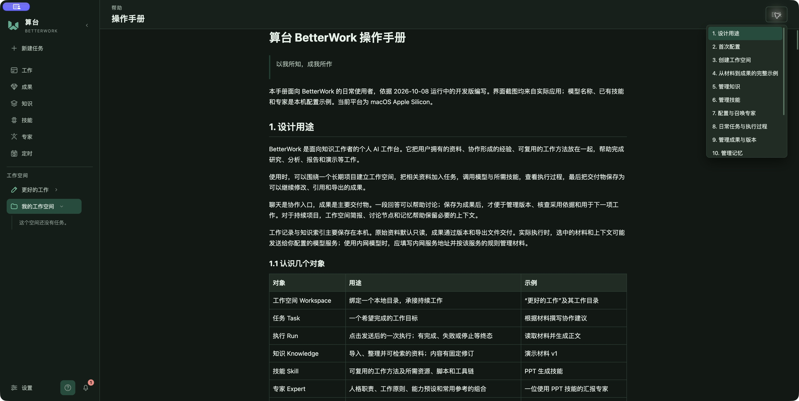

### 阅读导航

- [首次配置](#2-首次配置)
- [创建工作空间](#3-创建工作空间)
- [从材料到成果的完整示例](#4-从材料到成果的完整示例)
- [管理知识](#5-管理知识)
- [管理技能](#6-管理技能)
- [配置与召唤专家](#7-配置与召唤专家)
- [日常任务与执行过程](#8-日常任务与执行过程)
- [管理成果与版本](#9-管理成果与版本)
- [管理记忆](#10-管理记忆)
- [配置定时任务](#11-配置定时任务)
- [本地数据与备份](#12-本地数据与备份)
- [常见问题](#13-常见问题)

## 2. 首次配置

点击侧栏底部 **设置**。普通 Markdown 协作至少需要一个可用的语言模型；语义检索、联网搜索、MCP 和脚本技能各有自己的配置条件。

### 2.1 模型

进入 **设置 → 模型**，可以查看模型角色、启用状态和默认模型。

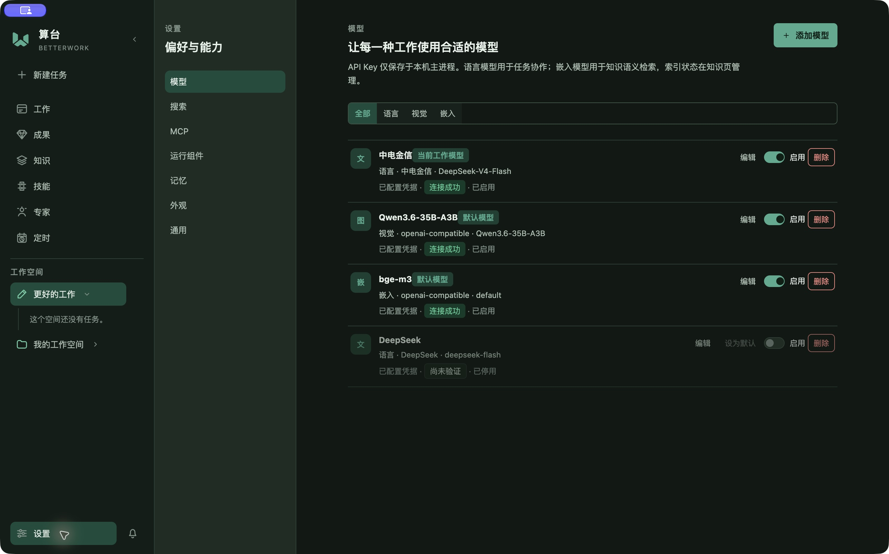

添加模型的步骤：

1. 点击 **添加模型**。
2. 选择模型角色，填写显示名称、Provider、模型 ID、API 地址和必要的 API Key。
3. 按服务提供方的要求填写地址；例如兼容接口常使用包含 `/v1` 的服务根地址。模型 ID 必须是服务实际提供的 ID，显示名称可以自行命名。
4. 如需调整上下文与输出长度，展开 **高级设置**，填写上下文 Token 和最大输出 Token。
5. 测试连接，确认服务可访问后保存。测试连接会访问该模型服务。
6. 启用需要使用的模型，点击 **设为默认** 指定相应角色的默认模型；语言模型会标记为 **当前工作模型**。

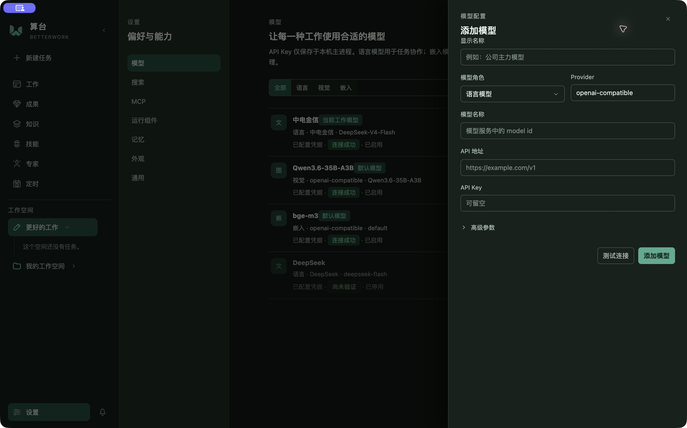

| 模型角色 | 使用场景 |
| --- | --- |
| 语言模型 | 任务协作、理解材料、生成内容和调用工具 |
| 嵌入模型 | 为知识生成向量，支持语义与混合检索 |
| 视觉模型 | 当前可配置并测试连接；不要据此推断所有图片理解流程均已接入 |

本手册的正文演示使用已有的内网语言模型。首次使用不需要照抄截图中的模型名称；应选择自己已经配置且可用的服务。任务输入框底部会显示当前模型，专家也可以配置模型偏好。

### 2.2 搜索

进入 **设置 → 搜索**，填写当前界面支持的搜索服务与 API Key，测试连接后点击 **保存并启用**。本版界面展示的是百度千帆 AI 搜索配置。

搜索配置完成后，还需要在任务中允许使用相应能力，并明确检索目标。任务涉及内网资料时，应先决定哪些问题允许发送给外部搜索服务。

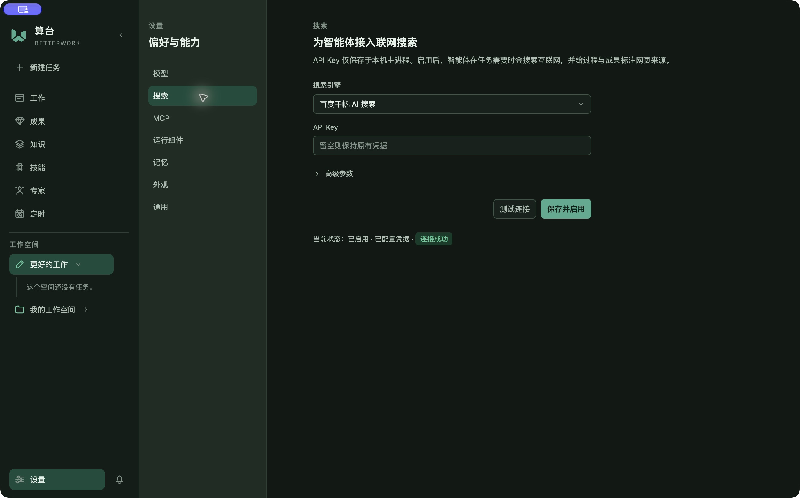

### 2.3 MCP

进入 **设置 → MCP**，点击 **新建连接**，选择服务提供的接入方式：

| 连接方式 | 填写内容 |
| --- | --- |
| 本地 stdio | 名称、启动命令、每行一个参数、可选工作目录及环境变量。机密环境变量单独加密保存 |
| Streamable HTTP | 服务地址及认证方式；包括明确授权的本机 HTTP 服务 |
| 旧 HTTP+SSE | 服务提供的旧 SSE 地址及认证方式 |

远程服务使用 HTTPS；本机 HTTP 地址填写 `127.0.0.1` 或 `[::1]`，并明确授权主机与端口。私网 HTTPS 也需要明确授权。Streamable HTTP 的旧 SSE 兼容选项默认关闭，仅在服务说明需要时启用。

HTTP 认证可选无认证、Bearer、API Key 请求头或 OAuth。已有机密只显示「已配置」，留空沿用；清空需明确选择。OAuth 保存后点击 **登录**，先检查授权服务器和权限，再打开系统浏览器；等待期间可 **取消登录**。服务需要预注册客户端时，在高级设置填写 Client ID、issuer 和所需回调端口；缺少注册信息时按错误提示补齐。

新连接默认停用。保存后登录或 **检测**，展开工具并 **确认只读合同**，再在更多菜单启用连接。任务右侧 **资料** 面板的 **本次 MCP 工具** 和专家预设用于选择具体工具；检测、审阅、启用与任务选择分别生效，新增工具不会自动获准使用。明确声明写入或破坏性操作的工具不可用。

合同变化或检测失败时，旧工具目录会标记失效；重新检测、审阅并选择后再执行。正在进行的检测可取消；停用、退出登录或移除连接会取消使用该连接的运行，历史记录仍保留。退出登录表示本地授权已清除。登录/检测结果可在消息中心回看。

### 2.4 运行

进入 **设置 → 运行**，管理运行策略并查看 BetterWork 提供的受管 CPython。

内置 Skill 和专家开关会影响列表与新 Run 的可用范围，更改后立即自动保存；Skill 工具调用上限默认 200，可设置为 1–1000，输入有效值并停止后自动保存，只作用于新 Run。受管 CPython 用于支持脚本技能；版本和落地状态由应用管理，通常无需选择 Python 路径。单个技能的 Python 环境、依赖与外部工具链仍需在技能详情中检查和准备；基础 Python 可用不代表所有技能都已就绪。

运行策略与受管 Python 状态显示在同一分区。

### 2.5 外观

在 **设置 → 外观** 中选择浅色、深色或跟随系统，再选择青玉、纸墨、远洋、暖砂等色系。应用外观不会改变成果文件本身的文档或演示配色。


### 2.6 通用

在 **设置 → 通用** 中可以设置工作对话中 AI 与自己的显示称呼。两个字段即时保存。

记忆的保存、召回和自动提炼配置见[管理记忆](#10-管理记忆)。

## 3. 创建工作空间

工作空间适合一个需要持续积累资料与成果的主题。开始前先准备好本地文件夹。

1. 点击 **新建任务**，进入工作页。
2. 打开任务输入框中的工作空间选择器，选择 **新建工作空间**。
3. 点击本地文件夹入口，在 macOS 文件选择器中选择已有目录。
4. 填写工作空间名称，选择图标和颜色，然后点击 **创建**。
5. 检查输入框中的工作空间名称，再开始任务。

本手册使用的工作空间已经创建：

```text
名称：更好的工作
目录：/Users/kevin/BetterWork-Workspace
```

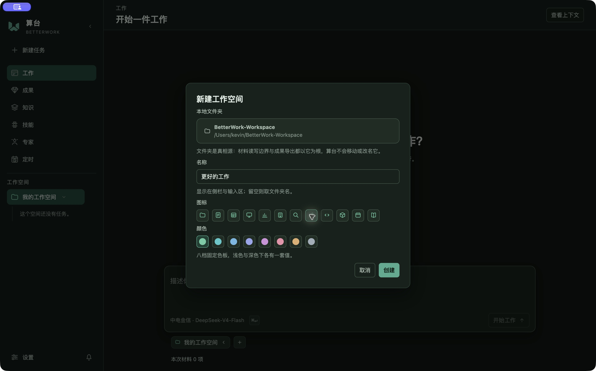

侧栏的工作空间分组用于展开或收起其任务。切换工作目录时，应在新任务的工作空间选择器中选择目标空间；已有任务仍属于原来的工作空间。

工作空间旁的菜单提供名称、图标、颜色等管理操作，以及 **从侧栏隐藏**。隐藏后可以通过工作空间选择器再次使用。隐藏空间不会删除目录，也不会清除工作记录。

## 4. 从材料到成果的完整示例

这组操作已在“更好的工作”中实际完成。它演示资料导入、选定修订、读取材料、生成正文、保存成果、人工修订、声明采用依据和导出文件。

### 4.1 准备演示材料

示例原文见 [collaboration-notes.md](examples/collaboration-notes.md)。它是一份虚构的协作方式说明，不含真实业务数据。

本机演示副本位于：

```text
/Users/kevin/BetterWork-Workspace/手册演示材料.md
```

复现时，可以把示例另存为自己的工作目录中的 Markdown 文件。

### 4.2 导入知识

1. 打开 **知识**，点击 **导入资料**。
2. 选择演示文件，等待导入作业完成。
3. 在列表中打开 **查看详情**，核对保存的正文、来源路径和修订。

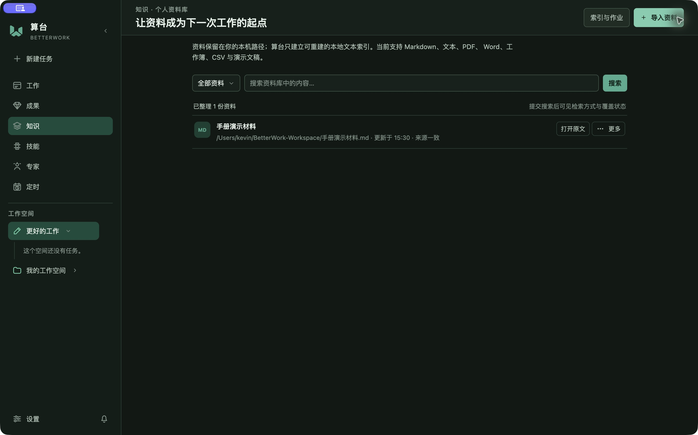

导入后可以通过 **索引与作业** 查看处理状态。本机已有可用嵌入模型，因此示例也完成了向量索引；没有嵌入模型时仍可使用关键词检索。

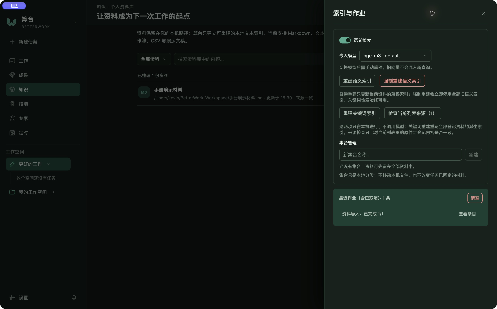

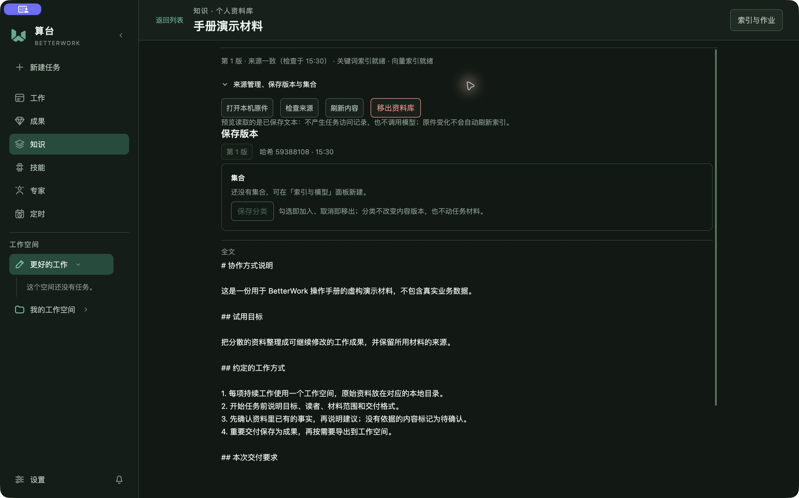

### 4.3 把材料加入本次任务

1. 回到 **工作**，新建任务并选择“更好的工作”。
2. 点击 **添加能力 → 引用知识**。
3. 选择“手册演示材料”的修订 v1，点击 **添加已选材料**。
4. 打开 **查看 / 管理**，在右侧 **资料** 面板核对材料和用途。本例使用 **规则口径**。
5. 输入下面的要求并发送。

```text
手册演示：从材料到成果
请先用知识检索读取本次选中的《手册演示材料》修订 v1，再根据它写一份不超过 300 字的使用建议。
标题为《BetterWork 协作入门》，包含「目标」「操作顺序」「检查清单」三个小节。
只使用本次材料；不要联网搜索、抓取网页或运行脚本。给出 Markdown 正文。
重要事实不得超出资料，需要额外确认的事项请明确标记。
```

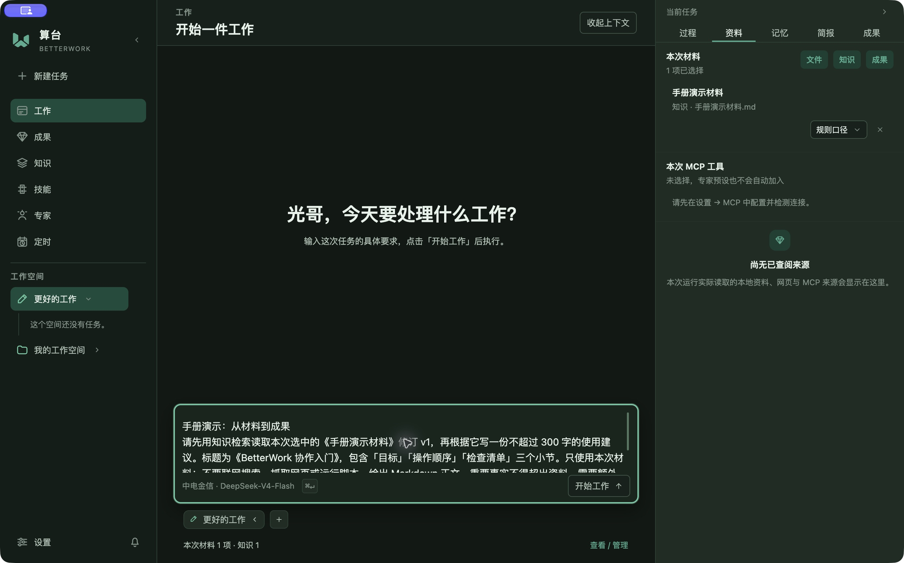

### 4.4 查看完成结果

等待本次执行结束，检查回答与右侧过程、材料读取记录。示例中模型先遇到一次读取游标错误，随后重新检索和读取，最终执行完成。单项工具失败需要结合最终执行状态判断。

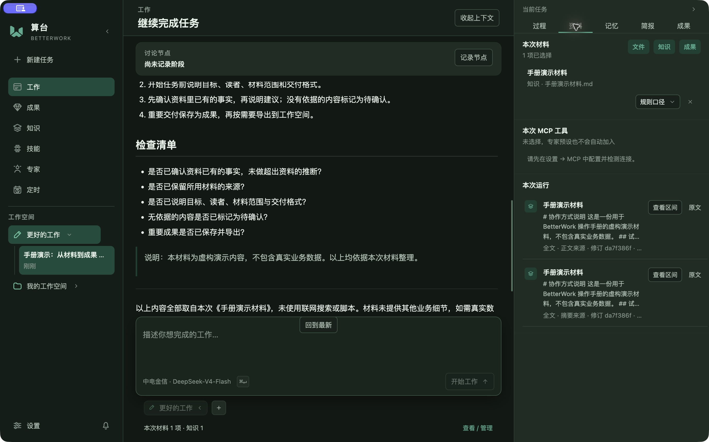

### 4.5 保存、修订和导出

1. 点击回答上的 **保存为成果**，生成 Markdown 成果 v1。
2. 在 **成果** 中打开它，点击 **编辑此版本**，把标题改为“BetterWork 协作入门（手册演示）”，保存为 v2。
3. 再次编辑，在采用依据中勾选实际使用的演示材料，设置用途为 **规则口径**，保存为 v3。
4. 展开 **参考设置与声明采用依据**，核对选择；本例还把 v3 指定为本空间参考版本。
5. 点击 **导出 Markdown**，选择工作目录并保存。

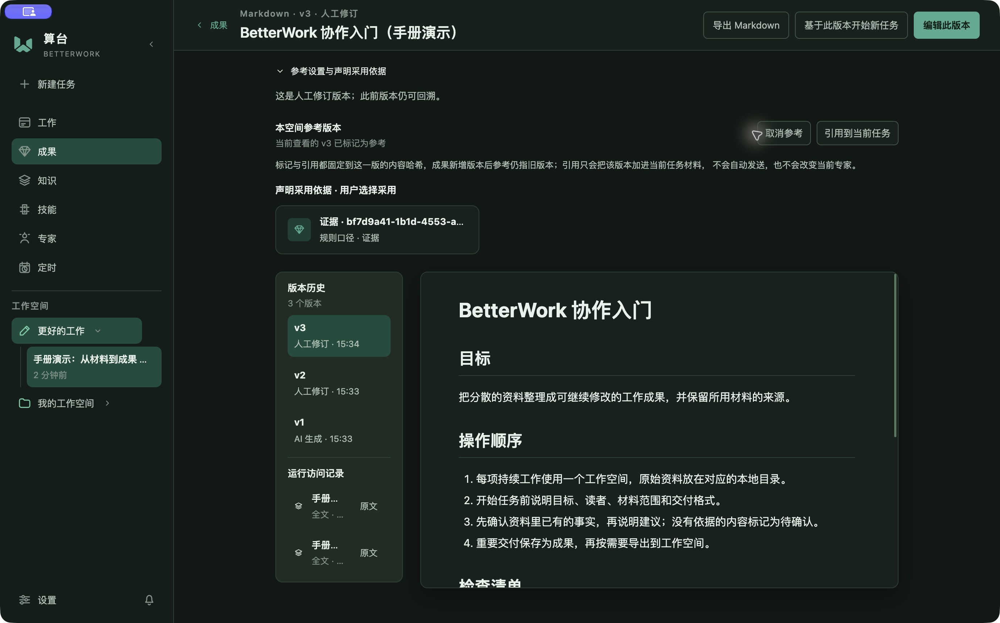

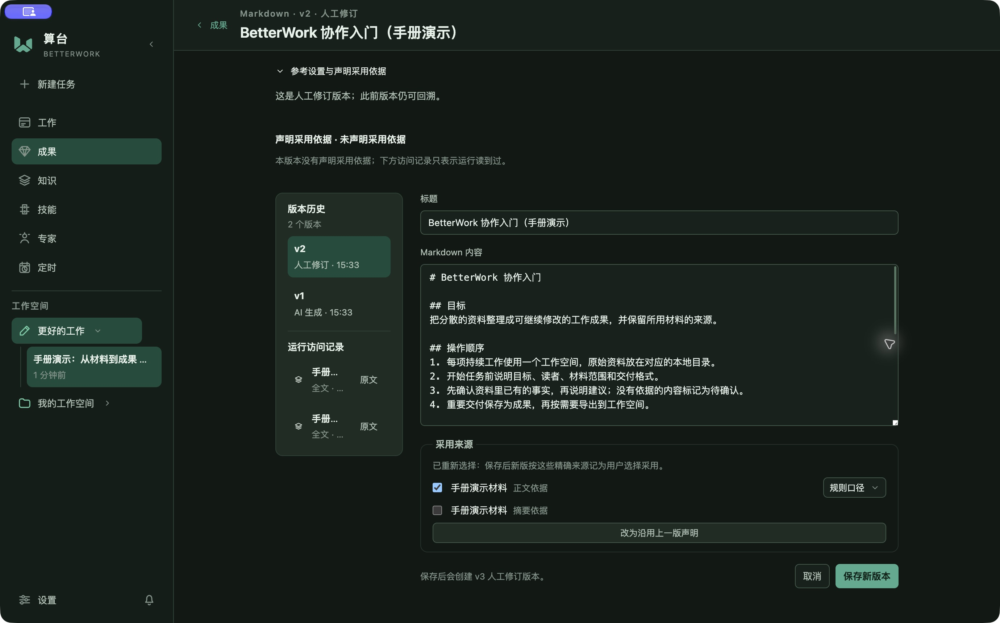


本机已导出到：

```text
/Users/kevin/BetterWork-Workspace/BetterWork 协作入门（手册演示）.md
```

导出文件与应用中 v3 的 Markdown 正文已核对一致。内容质量仍需使用者审阅，完成或保存状态不会替代业务审核。

## 5. 管理知识

### 5.1 导入与查看

当前支持 Markdown、Text、PDF、DOCX、XLSX、CSV 和 PPTX 本地资料，单文件上限为 20 MB。图片 OCR 和 HTML 导入不属于这条已实现的导入路径。

知识列表中的 **打开原文** 会打开原始文件；**查看详情** 展示 BetterWork 已保存的正文、修订和来源信息。查看详情本身不会调用语言模型，也不会产生当前任务的模型读取记录。

导入和索引默认不修改原始文件。应用登记来源、提取内容并保存可追溯的修订；原文件仍留在你选定的位置。

### 5.2 更新资料与管理集合

原文件改动后，先检查来源状态。来源可能显示一致、已变化、缺失或无法读取。

通过刷新操作重新提取后，知识会形成新的修订。已经运行的任务仍指向当时选中的修订；需要使用更新内容时，在下一次执行前重新选择相应材料版本。

资料集合用于按主题整理知识。把文档加入集合不会移动原文件。可以按资料集合筛选、检索或为周期工作选择范围。

### 5.3 检索与索引

| 检索方式 | 条件与用途 |
| --- | --- |
| 关键词检索 | 使用本地全文索引，适合名称、术语和明确词组；不需要嵌入模型 |
| 语义检索 | 需要可用的嵌入模型与向量索引，适合表述不同但含义接近的问题 |
| 混合检索 | 结合关键词与语义线索；可用性取决于相关索引状态 |

在 **索引与作业** 中检查语义开关、使用的模型、索引进度和作业结果。切换嵌入模型后，按界面提示重建向量索引，不能把不同模型生成的旧向量直接当成新索引。

长作业提供状态和取消入口。取消或失败后，应先查看具体结果，再决定是否重试；关键词检索与语义索引的就绪状态需要分别判断。

### 5.4 导入不等于本次采用

使用资料时，需要区分四个动作：

1. **入库**：资料已经登记在知识中。
2. **选入任务**：某个固定修订进入本次材料范围。
3. **实际读取**：模型成功访问该内容，并形成读取记录。
4. **声明采用**：成果注明哪些材料确实构成其依据。

这四步不能互相替代。核对结论时，应同时检查材料版本、运行读取记录和成果采用依据。

## 6. 管理技能

### 6.1 导入技能

打开 **技能**，查看现有技能。可以导入包含 `SKILL.md` 及其资源的文件夹、ZIP 包，或通过 **从链接导入** 下载 HTTPS ZIP 包。

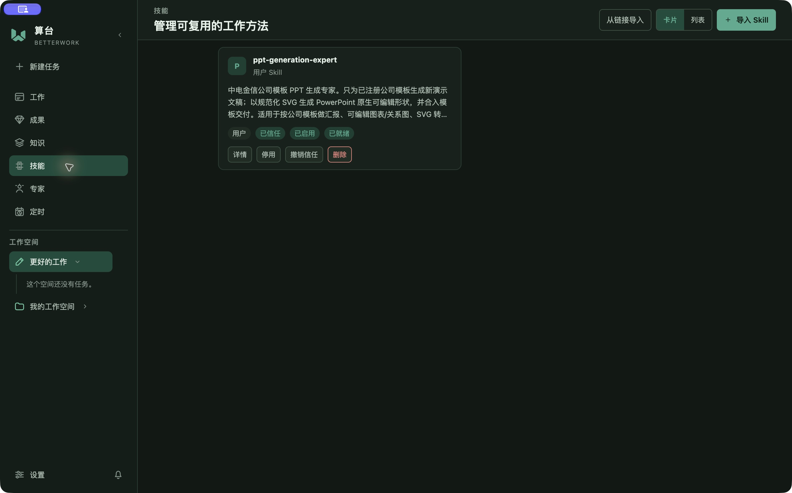

导入时读取元数据和检查结构，不会执行包内脚本。导入技能默认未信任；使用前应查看说明、脚本需求、文件访问范围和依赖，再按需要信任并启用。

内置技能与用户技能有不同的管理权限。需要修改内置内容时先创建用户副本；已有用户副本可以按界面提供的操作管理和导出。

### 6.2 检查就绪状态

打开技能详情，分别检查来源、启用、信任和环境状态。

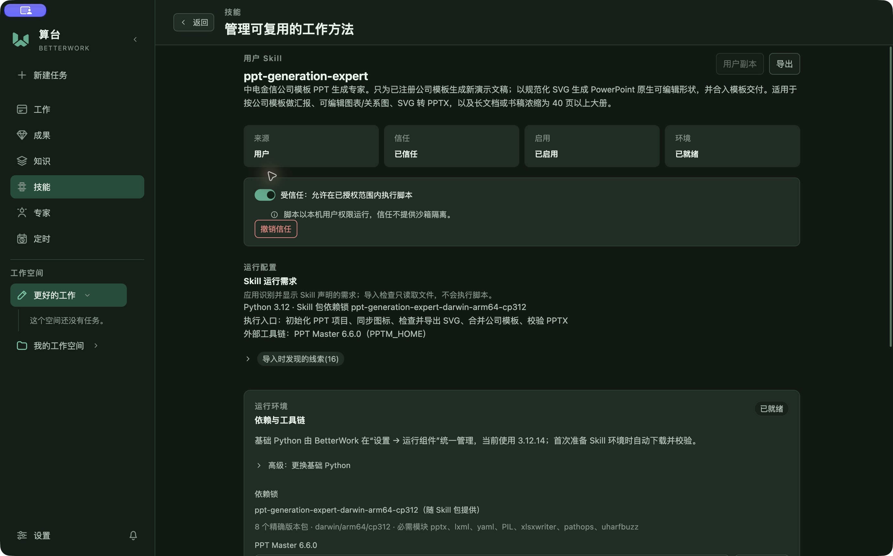

| 状态 | 需要检查什么 |
| --- | --- |
| 已导入 | 应用能识别技能的定义与资源 |
| 已启用 | 技能可以进入可选范围 |
| 已信任 | 用户允许在声明的范围内使用相应能力 |
| 环境已就绪 | Python、包依赖与外部工具链满足运行要求 |

有脚本的技能还需要准备环境。使用 **检查环境** 查看缺项，再使用 **准备环境** 或重新准备的修复入口处理。准备过程可能安装声明的依赖或准备工具链，按界面状态等待并检查结果；需要时可以取消。

已登记的资源和工具链按快照使用。修改原来的导入目录，不代表应用中的已登记内容已经更新；更新后应重新核对依赖、授权和就绪状态。

信任与原生进程沙箱是不同概念。信任某项技能，应以理解它会调用的命令、读写范围和所需依赖为前提。

### 6.3 在任务中使用技能

在任务输入框的 **添加能力** 中选择技能，或召唤带有技能预设的专家，再明确目标、输入材料和输出文件要求。

试运行会实际调用已配置模型，并可能执行已授权脚本。执行 PPT 等文件任务前，检查输出格式、模板和环境；完成后核对登记的文件成果及质量报告。

本手册检查了已有 PPT 技能的配置和就绪状态，正文示例使用知识读取与 Markdown 生成。PPT 脚本执行、真实演示文稿质量和外部工具链安装没有在这次正文演示中进行验收。

## 7. 配置与召唤专家

### 7.1 创建专家

进入 **专家**，点击 **新建专家**。

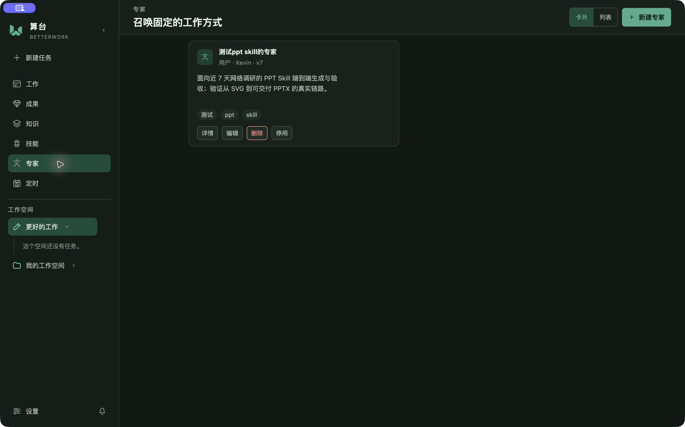

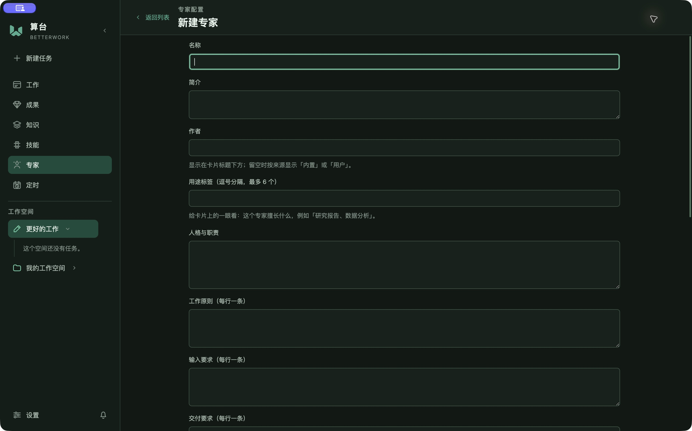

按实际工作填写以下内容；表单较长，需要向下滚动：

| 配置 | 建议填写的内容 |
| --- | --- |
| 名称、简介、作者、用途标签 | 便于识别工作领域和用途 |
| 人格与职责 | 这位专家承担的角色与责任 |
| 工作原则 | 每行一个原则，如“先核对资料，再提出建议” |
| 输入要求、交付要求 | 必要材料、报告结构、输出格式、质量要求 |
| Skill 预设 | 这个角色通常需要的技能 |
| 内置工具范围 | 按工作需要使用默认范围或选择具体工具 |
| 模型偏好 | 使用默认语言模型或指定已配置模型 |
| MCP 工具预设 | 常用工具候选；当前任务仍需明确选择 |
| 常用参考 | 适用的固定知识修订或当前工作空间成果版本 |

保存后形成专家修订。修改配置后，后续任务使用新的修订，已经发生的执行保留当时的配置与来源。内置专家需要按界面提供的用户副本方式修改。

### 7.2 召唤专家

点击专家卡片上的 **召唤**，直接进入工作页。检查输入框中的专家、技能、工作空间，以及右侧材料与工具范围，然后填写具体任务要求并发送。


专家定义提供方法和默认要求，本次任务仍需要具体目标与材料。专家有技能预设，也要确保相关技能当前已启用、已信任并且环境就绪。

## 8. 日常任务与执行过程

### 8.1 写清工作要求

开始任务时，至少说明目标、读者、材料范围、交付格式与检查标准。例如：

```text
目标：整理本周客户访谈中反复出现的问题。
读者：产品团队。
材料：只使用本次选中的两份访谈修订。
交付：Markdown，包含发现、依据、待确认事项三个小节。
要求：区分材料中的事实与建议；缺少依据时标记待确认。
```

持续修改同一交付物，可以留在原任务继续协作。工作目标已明显变化时，新建任务，并明确引用需要继承的成果版本。

### 8.2 管理本次材料

使用 **添加能力** 中的 **添加文件**、**引用知识**、**引用成果**，把所需材料加入当前任务。通过 **查看 / 管理** 打开资料面板，核对固定版本、材料范围和用途。

材料用途包括数据依据、规则口径、历史对比、结构参考、模板、背景参考和其他。用途帮助说明“怎样使用这份材料”，不能替代模型实际读取。

直接文件受工作空间和本次运行范围限制；知识引用锁定修订，成果引用锁定版本。执行开始时会固定本次配置，后续调整用于下一次执行。

### 8.3 查看过程与停止运行

右侧上下文面板根据工作场景展示 **过程、资料、记忆、简报、成果**。需要时展开查看，也可以完全收起以留出正文空间。

在 **过程** 中查看执行阶段、工具调用和终态。遇到错误时，先判断是某个步骤失败，还是本次执行最终失败，再阅读具体提示。

运行过程中，输入区出现 **停止**。点击后等待“已停止”等明确终态；已经生成的部分文字可供查看，但不能据此认为任务已完成。

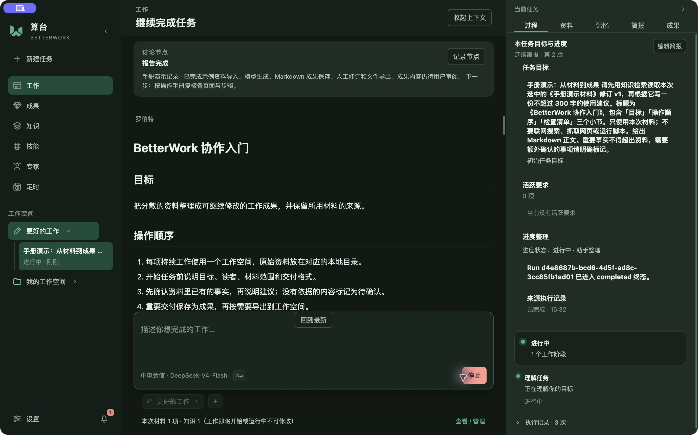

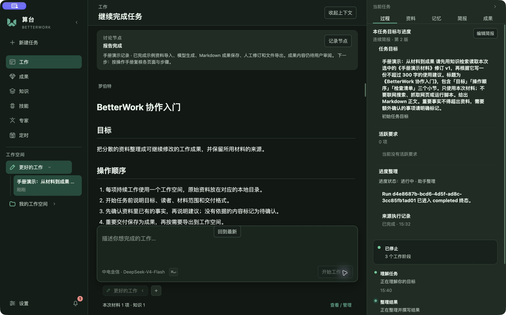

### 8.4 连续简报与讨论节点

在 **过程 → 本任务目标与进度 → 编辑简报** 中维护任务目标、活跃要求和进度。新建任务会开始记录连续简报；旧任务不会自动从全部历史对话回填。

**简报** 面板提供工作空间层面的持续上下文。继续工作前，核对目标、约束、已有进展、阻塞和下一步，减少只靠长聊天回忆项目状态的情况。

在协作的关键阶段点击 **记录节点**，选择理解目标、研究完成、报告大纲、报告完成、PPT 大纲、PPT 完成或迭代返工等阶段，填写标题、当前结论、审阅反馈、下一步，并按需关联成果版本。

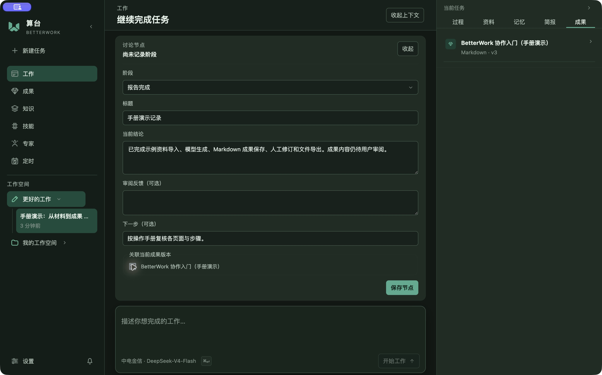

节点是可回看的工作记录。没有填写审阅反馈、没有用户明确确认时，不应把“报告完成”节点当成人工验收通过。

## 9. 管理成果与版本

### 9.1 保存与查看

对需要保留的模型回答点击 **保存为成果**。在 **成果** 页面打开交付物，通过版本历史查看 v1、v2、v3 等版本及其来源。

Markdown 成果可以在应用中预览和编辑。技能产生的 PPT 等文件成果按应用提供的文件入口查看、打开或导出；文件类型是否可在应用内编辑，应以实际入口为准。

### 9.2 修订与采用依据

点击 **编辑此版本**，修改标题、Markdown 正文和采用依据，再保存为新版本。旧版本保留，便于比较与追溯。

成果中的两种信息需要分别阅读：

- **运行访问记录**：本次执行成功读取过哪些材料。
- **声明采用依据**：哪些材料被明确声明为该成果的依据，以及其用途。

保存回答之后，应展开核对采用依据。即使运行过程中读取过材料，或调用过来源声明工具，保存后的成果也可能仍显示“未声明采用依据”；需要时通过人工修订补充真实采用的来源。

### 9.3 固定参考版本与复用

展开 **参考设置与声明采用依据**，可以把某一版 **指定为本空间参考版本**。参考关系固定到该版本，不会在产生新版后自动改指，也不代表内容已经审定。

需要继续工作时，可以：

- 点击 **基于此版本开始新任务**，以选定版本作为新任务起点。
- 通过当前任务的 **引用成果** 选择确切版本，或使用可用的引用到当前任务入口。

在正式引用前，检查版本号、适用工作空间和声明采用依据。

### 9.4 导出

打开目标版本，点击 **导出 Markdown**，在系统保存窗口选择目录和文件名。导出的是当前选中的版本；导出后修改文件不会自动形成应用内的新版本。

交付前同时核对应用中的版本和导出的文件。原始材料、应用成果版本和导出文件各有自己的保存位置，需要分别管理。

## 10. 管理记忆

### 10.1 打开与新增

进入 **设置 → 记忆**，管理可复用的经验。也可以在回答上使用 **记住这段经验**，把协作中的结论作为记忆草稿并保留来源。

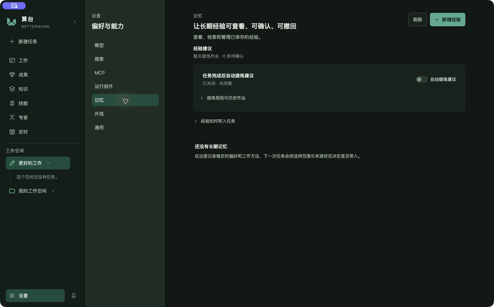

点击 **新增经验**，填写正文，选择类型、适用范围，并按需填写主题、生效日期和截止日期。类型包括目标、约束、决策、事实、工作方法、表达偏好和历史经验。

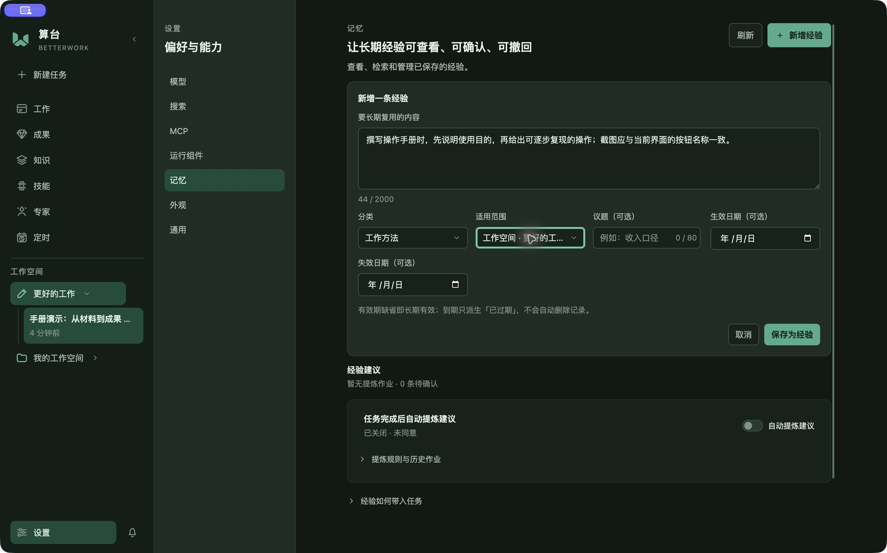

适用范围取决于当前上下文：可以用于所有工作、当前工作空间、特定专家或专家在某个工作空间中的工作。没有活动专家时，界面不会提供需要该专家上下文的范围。

保存前检查表述是否具体、仍然有效、来源是否可靠。带日期的记忆需要核对适用时间；到期状态不等同于自动删除记录。

### 10.2 召回与本次不用

任务的 **记忆** 面板展示与当前工作有关的记忆及其使用情况。对本任务不适用的内容使用 **本任务不用**；该任务继续执行时保持排除，恢复后才重新参与。

**优先带入** 有适用条件：有效、已确认、来自用户直接表达并且不依赖资料来源的指令类内容才适合使用。事实和历史经验不能一概当作优先指令。

### 10.3 自动提炼

每个工作空间的自动提炼有独立开关与同意状态。启用后会调用所配置模型，从适用的协作内容中提出候选；候选需要审阅、编辑与确认后再作为可靠经验使用。

这项能力不会自动扫描全部聊天，也不提供定时反思。关闭自动提炼后，仍可手动记录经验。

本次手册演示保留了自动提炼关闭状态。新增经验表单只填写用于截图的草稿，随后取消，未新增记忆。

### 10.4 审阅、停用与口径冲突

在记忆管理的 **待确认** 分组中检查候选，点击 **编辑并确认** 核对正文、来源、适用范围和有效期；暂时不采用的候选可选择 **暂不采用**，之后按需 **恢复待确认**。

已确认经验可以编辑或 **设为过期**。确定以后不再使用时选择 **以后不用**：历史记录仍保留，但终态记录不能恢复。调整只影响后续运行，正在执行的上下文不会被即时改写。

出现相互冲突的工作口径时，先查看双方来源和适用条件。界面提供替代其中一条，或填写条件后 **确认两条并存**。无法说明各自适用条件时，保留待澄清状态，避免把冲突口径同时当成有效指令。

## 11. 配置定时任务

定时任务适合按周期重复的工作，例如每月根据持续工作目录中的资料形成报告。

1. 打开 **定时**，点击 **新建定时任务**。
2. 选择已有专家和持续工作空间。选择专家会固定当前修订。
3. 按需选择附加知识范围；可以针对文档、资料集合或知识库设置范围。
4. 填写定时任务名称和每期工作要求。历史对比、报告结构和模板要求写在这里。
5. 选择预期成果：演示文稿（PPTX）、Markdown 报告，最多两种。需要 PPT 时，专家与技能必须具备相应能力。

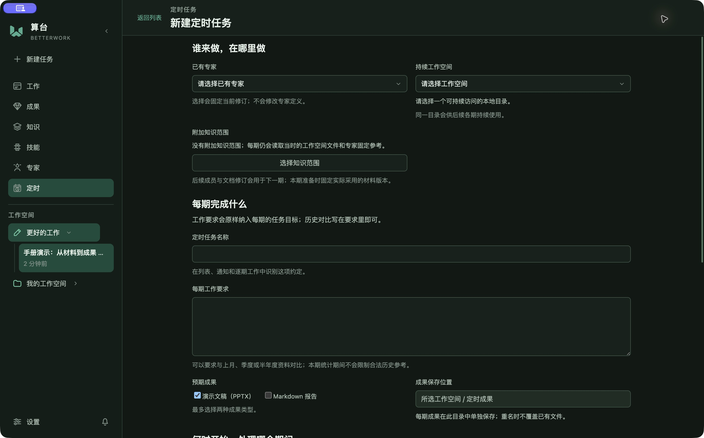

6. 设置每天、每周或每月的重复频率、具体日期或星期、执行时刻与固定时区。
7. 设置本期统计期间，查看 **接下来三次计划**，确认期间与时间符合预期。
8. 尚未准备执行时选择 **保存并暂停**；准备好后选择 **保存并启用**，并处理模型、专家能力或环境检查提示。

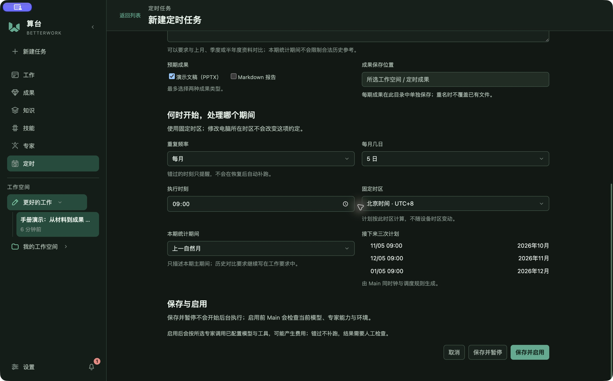

每期成果保存在所选工作空间下的 **定时成果** 目录，按期单独保存，重名时不覆盖已有文件。

知识范围的成员和文档修订可以随时间更新，下一期准备时会固定实际使用的材料版本。本期统计期间描述主期间，工作要求中的合法历史参考仍然可以使用。

计划采用固定时区，不随电脑时区改变。设置每月 29–31 日时，没有该日期的月份会跳过，不会自动改为月末。

应用需要运行、电脑需要能够执行工作。关机、退出或休眠导致错过的时刻不会自动补跑；恢复后查看提醒和各期状态，再按实际入口选择手动执行或补做，并检查成果。暂停用于停止后续自动开始；已经开始的执行应通过其停止入口处理。

本手册只检查了定时配置表单并截图，随后取消，未创建或启用周期任务。

## 12. 本地数据与备份

BetterWork 使用本地数据库保存工作空间登记、任务、执行记录、成果版本和配置，知识库也有自己的数据库。原始资料和导出文件通常位于用户选择的工作目录。

开发版在本机使用的数据目录为：

```text
~/Library/Application Support/@betterwork/desktop/
├── betterwork.db
└── vaults/default/vault.sqlite
```

安装版的具体应用数据目录可能与开发版不同；备份前应确认正在使用的版本与路径。

完整备份建议按以下顺序进行：

1. 等待执行和导入结束，正常退出应用，确保相关进程已停止写入。
2. 备份整个实际应用数据目录，保留数据库、配套文件、配置、技能资源和必要的本地存储。仅备份单个数据库不能代表完整环境备份。
3. 另行备份各工作空间目录，包括原始资料、模板和导出的文件；这些目录不一定在应用数据目录里。
4. 保存备份时间、应用版本、目录位置和恢复说明。
5. 恢复前先备份当前状态，关闭应用，再恢复对应的数据目录与工作文件。重新启动后检查模型连接、技能环境和原文件路径。

凭据可能依赖当前 macOS 用户和系统保护机制，整目录复制不能保证跨机器直接可用。不要把包含凭据、用户资料的完整备份公开发布。

隐藏工作空间、停用技能、关闭提炼与删除业务记录是不同操作。本版没有在这里提供一键“只保留配置并清空其他数据”的通用界面流程；维护数据前先明确范围并备份。

## 13. 常见问题

| 现象 | 检查与处理 |
| --- | --- |
| 无法开始或模型连接失败 | 检查语言模型是否启用、默认模型是否可用，核对地址、模型 ID、鉴权和内网连通性；重新测试连接 |
| 模型有配置但语义检索不可用 | 检查嵌入角色、语义开关、对应模型和索引状态；关键词检索可独立使用 |
| 提示材料已选中但未成功读取 | 每次执行都需成功读取本次材料；在要求中明确先读取固定修订。仅沿用上一轮回答可能触发材料校验失败 |
| 过程里某个工具失败 | 阅读具体错误与最终执行状态；模型可能调整后成功，也可能最终失败，需要分别判断 |
| 技能已启用但不能运行 | 分别检查信任、依赖、受管 Python 运行时与外部工具链；到技能详情检查或准备环境 |
| 找不到内置技能或专家 | 检查运行设置中的内置 Skill 和专家开关；开启后按需正常重启，不能根据列表数量推断内容已删除 |
| 专家的 MCP 工具没有出现在任务中 | 在资料面板检查本次 MCP 工具，明确选择本次允许使用的工具 |
| 原文变化了，任务仍使用旧内容 | 刷新来源形成新修订，下一次执行前重新选择材料；已发生的执行保留原来的固定版本 |
| 导入资料找不到原文件 | 检查原文件是否移动、目录是否仍可访问；应用保存的正文和原文件位置需要分别核对 |
| 成果有读取记录却没有采用依据 | 打开成果核对声明；通过编辑版本选择真正采用的材料及用途，再保存新版本 |
| 导出的内容不是预期版本 | 先在版本历史选择正确版本，再导出；应用内版本与外部文件独立管理 |
| 停止后仍看见部分文字 | 已生成片段可以保留，检查“已停止”终态；需要完成交付时调整要求后重新执行 |
| 记忆没有进入任务 | 检查是否已确认、是否适用当前范围与日期、是否被设置为本任务不用；候选不能等同于已确认记忆 |
| 定时任务没有按时完成 | 检查应用运行、电脑状态、暂停状态及模型/技能环境；错过的时刻不会自动补跑 |

遇到需要保留的异常，打开底部通知铃铛回看结果。反馈问题时记录所在页面、操作步骤、任务或成果版本及界面错误；不要附带 API Key。

## 14. 本手册的操作核验范围

本次已实际操作并核对：工作空间创建；配置页面；示例知识导入、正文与索引；固定材料选择；内网模型生成；Markdown 成果保存、三版修订、人工采用依据、固定参考版本与导出；讨论节点；运行停止。

专家召唤、记忆新增和定时配置界面已检查。其中专家召唤后未开始执行，记忆与定时草稿均取消。搜索和 MCP 的真实调用、PPT 脚本执行、候选记忆自动提炼、周期任务到期执行需要在对应环境中另行核验。

本手册以当前实际入口为操作依据。产品设计文档中的长期目标不直接构成已经可操作的功能；后续界面变化时，应同步更新步骤和截图。
